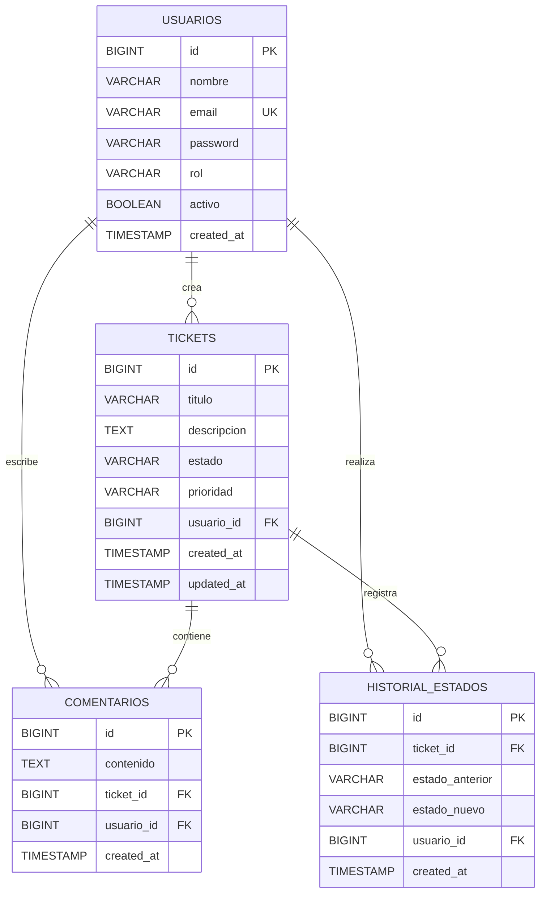

# Modelo de Datos Relacional

## Objetivo

Definir el modelo de datos relacional inicial para el Sistema de Gestión de Tickets e Incidencias.

El modelo está diseñado para PostgreSQL y será utilizado posteriormente mediante Spring Data JPA.

## Entidades

El modelo inicial está compuesto por:

* `usuarios`
* `tickets`
* `comentarios`
* `historial_estados`

## Diagrama relacional

### Interpretación de las relaciones

* Un **usuario** puede crear cero o muchos tickets.
* Un **usuario** puede escribir cero o muchos comentarios.
* Un **usuario** puede realizar cero o muchos cambios de estado.
* Un **ticket** puede tener cero o muchos comentarios.
* Un **ticket** puede tener cero o muchos registros de historial de estados.
* Cada ticket pertenece a un único usuario.
* Cada comentario pertenece a un único ticket y a un único usuario.
* Cada registro de historial pertenece a un único ticket y registra al usuario que realizó el cambio.

### Convenciones del diagrama

* `PK` — Primary Key / clave primaria.
* `FK` — Foreign Key / clave foránea.
* `UK` — Unique Key / restricción de unicidad.
* `||` — exactamente uno.
* `o{` — cero o muchos.

## Usuarios

Representa a las personas que utilizan el sistema.

### Campos

| Campo      | Tipo         | Restricción            |
| ---------- | ------------ | ---------------------- |
| id         | BIGSERIAL    | PRIMARY KEY            |
| nombre     | VARCHAR(100) | NOT NULL               |
| email      | VARCHAR(150) | NOT NULL, UNIQUE       |
| password   | VARCHAR(255) | NOT NULL               |
| rol        | VARCHAR(30)  | NOT NULL               |
| activo     | BOOLEAN      | NOT NULL, DEFAULT TRUE |
| created_at | TIMESTAMP    | NOT NULL               |

### Roles iniciales

* `USER`
* `AGENT`
* `ADMIN`

## Tickets

Representa las solicitudes o incidencias registradas en el sistema.

### Campos

| Campo       | Tipo         | Restricción  |
| ----------- | ------------ | ------------ |
| id          | BIGSERIAL    | PRIMARY KEY  |
| titulo      | VARCHAR(150) | NOT NULL     |
| descripcion | TEXT         | NOT NULL     |
| estado      | VARCHAR(30)  | NOT NULL     |
| prioridad   | VARCHAR(20)  | NOT NULL     |
| usuario_id  | BIGINT       | NOT NULL, FK |
| created_at  | TIMESTAMP    | NOT NULL     |
| updated_at  | TIMESTAMP    | NOT NULL     |

### Estados

* `OPEN`
* `IN_PROGRESS`
* `RESOLVED`
* `CLOSED`

### Prioridades

* `LOW`
* `MEDIUM`
* `HIGH`
* `CRITICAL`

Cada ticket pertenece a un usuario y un usuario puede tener múltiples tickets.

## Comentarios

Representa las respuestas o anotaciones realizadas sobre un ticket.

### Campos

| Campo      | Tipo      | Restricción  |
| ---------- | --------- | ------------ |
| id         | BIGSERIAL | PRIMARY KEY  |
| contenido  | TEXT      | NOT NULL     |
| ticket_id  | BIGINT    | NOT NULL, FK |
| usuario_id | BIGINT    | NOT NULL, FK |
| created_at | TIMESTAMP | NOT NULL     |

### Relaciones

* Un ticket puede tener cero o muchos comentarios.
* Un usuario puede crear cero o muchos comentarios.
* Cada comentario pertenece a un único ticket.
* Cada comentario pertenece a un único usuario.

## Historial de Estados

Registra los cambios de estado realizados sobre los tickets.

### Campos

| Campo           | Tipo        | Restricción  |
| --------------- | ----------- | ------------ |
| id              | BIGSERIAL   | PRIMARY KEY  |
| ticket_id       | BIGINT      | NOT NULL, FK |
| estado_anterior | VARCHAR(30) | NULLABLE     |
| estado_nuevo    | VARCHAR(30) | NOT NULL     |
| usuario_id      | BIGINT      | NOT NULL, FK |
| created_at      | TIMESTAMP   | NOT NULL     |

### Relaciones

* Un ticket puede tener cero o muchos registros de historial.
* Un usuario puede realizar cero o muchos cambios de estado.
* Cada registro pertenece a un único ticket.
* Cada registro identifica al usuario que realizó el cambio.

`estado_anterior` puede ser `NULL` cuando se registra el estado inicial del ticket.

## Relaciones y cardinalidades

| Relación                       | Cardinalidad |
| ------------------------------ | ------------ |
| Usuario → Tickets              | 1:N          |
| Usuario → Comentarios          | 1:N          |
| Usuario → Historial de estados | 1:N          |
| Ticket → Comentarios           | 1:N          |
| Ticket → Historial de estados  | 1:N          |

## Integridad

Se aplicarán las siguientes reglas:

* `usuarios.email` debe ser único.
* Todo ticket debe pertenecer a un usuario.
* Todo comentario debe pertenecer a un ticket y a un usuario.
* Todo registro de historial debe pertenecer a un ticket y a un usuario.
* Los estados de los tickets estarán limitados a los valores definidos.
* Las prioridades estarán limitadas a los valores definidos.
* Las claves foráneas deberán mantener la integridad referencial.
* Los campos obligatorios no permitirán valores `NULL`.

## Decisiones de diseño

Los estados y prioridades no tendrán tablas independientes en esta primera versión. Se manejarán mediante enums en Java y se almacenarán como valores textuales.

El estado actual se almacenará directamente en `tickets.estado`, mientras que `historial_estados` conservará los cambios realizados sobre dicho estado.

No se incorporan en esta etapa funcionalidades o entidades relacionadas con:

* Adjuntos.
* Notificaciones.
* Etiquetas.
* SLA.
* Encuestas de satisfacción.
* Auditoría avanzada.
* Integraciones externas.

Estas funcionalidades podrán incorporarse posteriormente si forman parte del alcance del sistema.
